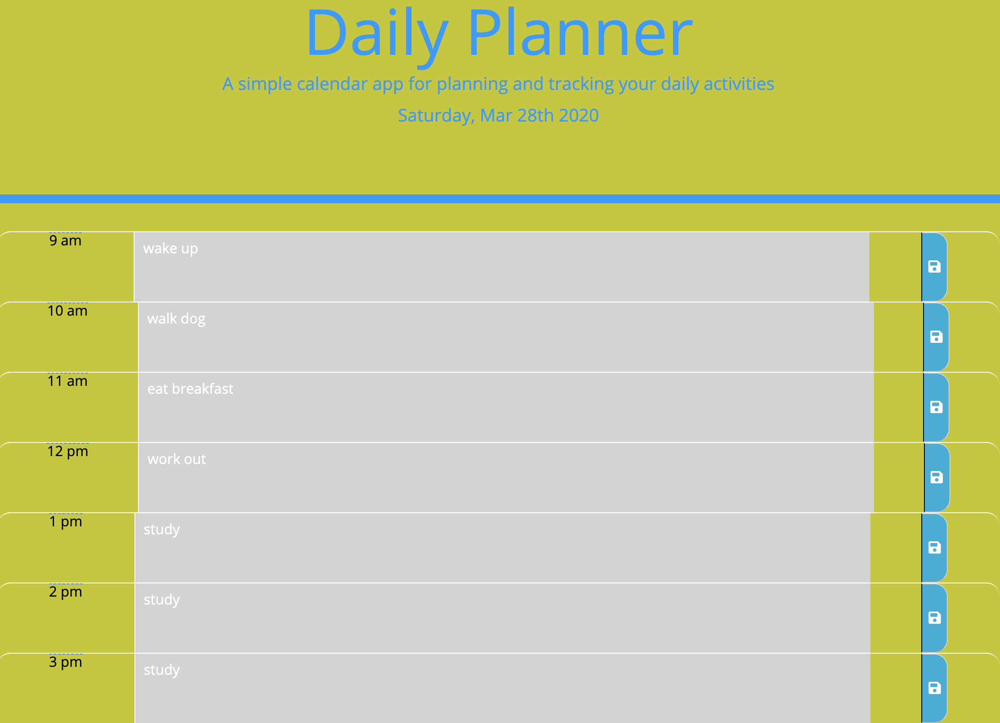
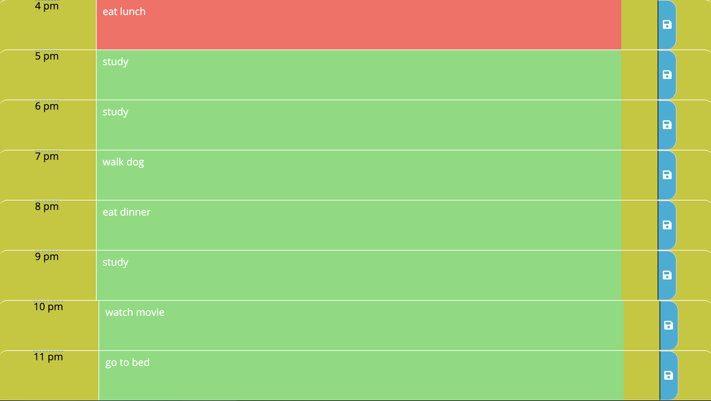

# Title 

Daily Planner

## Project Descritpion

This is a simple daily planner that allows you to add and track all you daily activities.On the top of teh screen you will be able to view the current date and tiem. The planner itself uses three different colors for its columns where you insert your activities. All past activities have a grey background where present are red colored and lastly you have the green color for the future activities. So those columns will change color acordingly. 
 
In addiion to all those feature the planner allows you to save your entry for each column by clicking the "save" icone on the right hand side of each of those sections. 
 
For a better visual understanding please take a look at the following screenshots.

### Screenshots

### How to access the quiz
URL:   https://k3vindi3s3l.github.io/k3vin.di3s3l.Planner/
 
URL: https://github.com/K3vinDi3s3l/k3vin.di3s3l.Planner

### Built With

* HTLM (https://developer.mozilla.org/en-US/docs/Glossary/HTML#Concept_and_syntax)
* JS (https://developer.mozilla.org/en-US/docs/Web/JavaScript)
* CSS (https://www.w3schools.com/css/)
